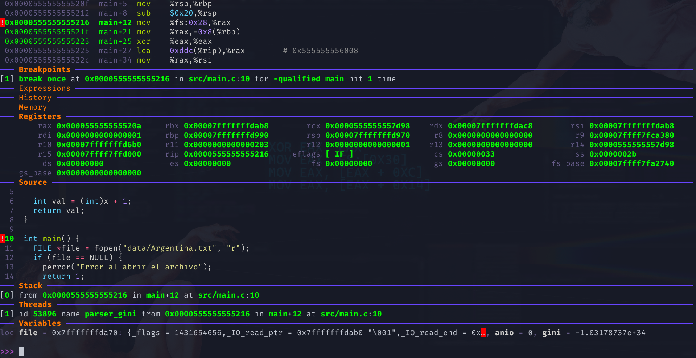
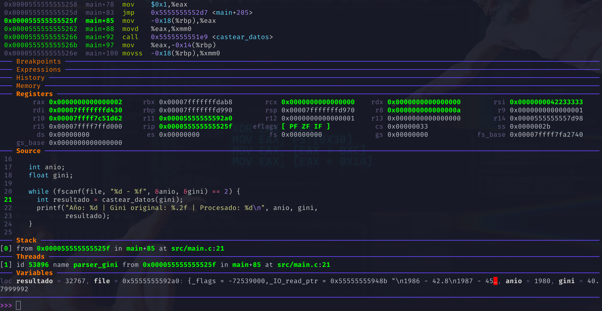
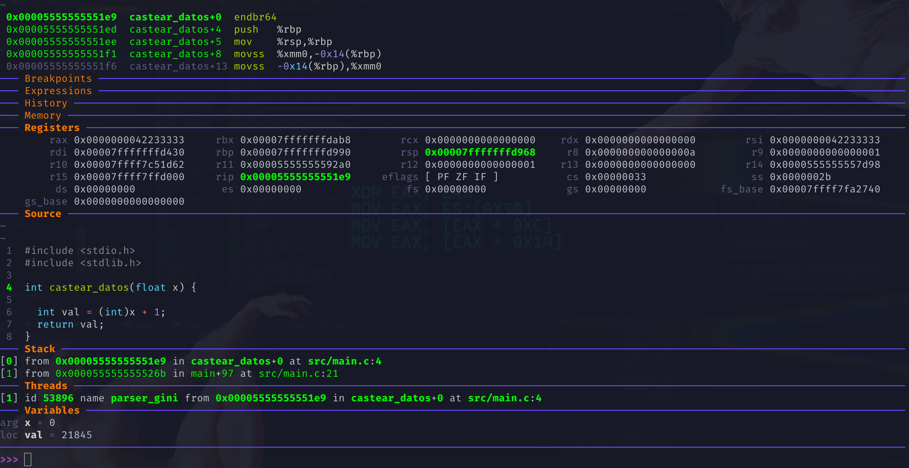
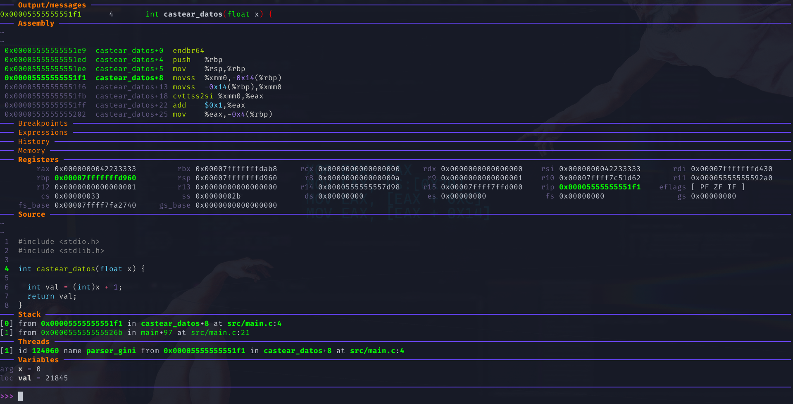
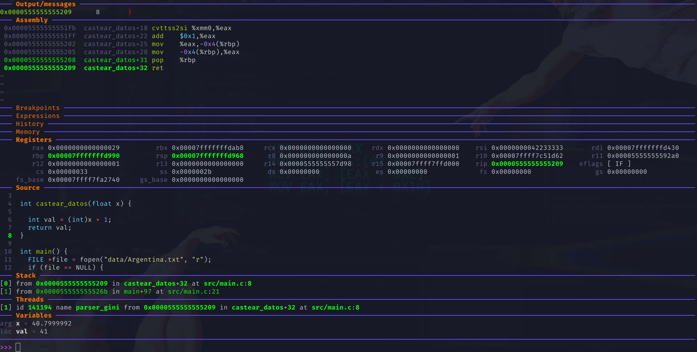

# Trabajo práctico 2 - Stack frame

## Nombres

- Nicolás Piñera
- Julián Krede
- Juana Pucheta Noguera

**Nombre del grupo**: Bare metal guys

## UNC - Facultad de Ciencias Exactas, Físicas y Naturales

## Cátedra: Sistema de Computadoras

### Profesores

- Javier Alejandro Jorge
- Miguel Ángel Solinas

**Fecha:** 21/04/2026

---

## Información de los autores

- **Información de contacto**:
  - [nicolas.pinera@mi.unc.edu.ar](mailto:nicolas.pinera@mi.unc.edu.ar)
  - [julian.krede@mi.unc.edu.ar](mailto:julian.krede@mi.unc.edu.ar)
  - [juana.pucheta.noguera@mi.unc.edu.ar](mailto:juana.pucheta.noguera@mi.unc.edu.ar)

---

## Introducción

<!-- Aca podría explicarse brevemente que es el indice GINI y que se busca hacer con este tp a grandes rasgos-->

## Desarrollo

### Arquitectura del sistema

En computación, existe una jerarquía de abstracción. Cuanto más "alto" es el lenguaje (como Python), más se aleja del hardware para facilitar la vida al humano. Cuanto más "bajo" (como ASM), más cerca está de la electrónica.

En nuestro caso construiremos una software de tres capas de Ejecución:

1. Capa de Orquestación (Python): Gestiona lo que es complejo para el humano pero simple para la máquina (redes, JSON, lógica de negocio).

2. Capa de Interfaz o Puente (C): Actúa como el traductor. C tiene la capacidad única de hablar con el mundo de alto nivel y manejar punteros de memoria de bajo nivel simultáneamente.

3. Capa de Optimización Extrema (ASM): Ejecuta tareas donde cada ciclo de reloj cuenta. Aquí no hay abstracción; solo instrucciones directas al procesador.

### Diferencia entre python y C

Python es un lenguaje cuya ejecución depende de un intérprete. A diferencia de C, el código fuente se traduce primero a un formato intermedio llamado Bytecode y luego es ejecutado por la Máquina Virtual de Python (PVM). Esto implica que el programa no corre de forma autónoma, sino que reside y es gestionado íntegramente dentro del entorno y el espacio de memoria del proceso python3.

C es un lenguaje de compilación nativa. El código fuente es compilado y se obtiene un archivo binario que contiene instrucciones en lenguaje máquina específicas para la arquitectura del procesador. Al ejecutarse, el procesador procesa estas instrucciones de forma directa y nativa, sin intermediarios, lo que permite un control total sobre el hardware y una velocidad de ejecución máxima.

### Estrategia de integración entre python y C

Para materializar la arquitectura propuesta, es necesario establecer un mecanismo de interoperabilidad entre la capa de orquestación (Python) y la capa de interfaz (C). Esta integración se logra mediante la compilación del código C como una librería dinámica (shared object) y su posterior carga en tiempo de ejecución desde Python utilizando el módulo `ctypes`.

El proceso se divide en dos etapas:

#### 1. Compilación del código C como librería dinámica

El código fuente en C se compila utilizando el compilador `gcc` con la opción `-shared`, lo que genera un archivo binario reutilizable. Este archivo contiene las funciones exportadas que actuarán como interfaz hacia niveles superiores.

Conceptualmente, este paso transforma el código C en un módulo binario independiente, accesible desde otros lenguajes. Es importante que las funciones expuestas respeten convenciones de llamada compatibles (en nuestro caso, System V AMD64 ABI), ya que Python interactuará con ellas a nivel de memoria y registros.

```bash
gcc -c -fPIC interface.c -o interface.o
gcc -shared  interface.o -o libinterface.so
```

#### 2. Carga y uso de la librería desde Python mediante `ctypes`

Una vez generada la librería dinámica, Python la carga en tiempo de ejecución utilizando `ctypes`. Este módulo permite invocar funciones escritas en C como si fueran funciones nativas de Python, pero operando directamente sobre memoria nativa.

```python
import ctypes

# Cargar la librería
lib = ctypes.CDLL("./libinterface.so")

# Ejemplo para una funcion suma que recibe 2 argumentos enteros y retorna la suma
# Definir tipos de argumentos
lib.suma.argtypes = (ctypes.c_int, ctypes.c_int)

# Definir tipo de retorno
lib.suma.restype = ctypes.c_int

# Usar la función
resultado = lib.suma(10, 25)

print(resultado)  # 35
```

### Analisis de código en C con gdb

Para realizar un análisis del funcionamiento del stack frame implementamos una programa en C que lee los datos recogidos por el programa en python (a través de un archivo `.txt`) y los imprime por pantalla, dentro de este programa implementamos una función que se encarga de realizar el casteo del valor en flotante a entero y sumarle 1. Para analizar la ejecución del programa utilizamos gdb dashboard:



Como se puede observar en la parte superior tenemos las instrucciones correspondientes en ensamblador a de la instrucción en C actual, ademas se puede observar el código en C correspondiente en el apartado *Source* y el estado actual de los registros en el apartado *Registers*. Ademas:

- En *Source* La línea en verde es la próxima linea en C a ejecutar (lo que GDB llama current execution line). Es a donde apunta el RIP en ese momento. 
- A su vez en la parte superior se remarca con verde las instrucciones en ensamblador a la que corresponde dicha linea de C. 
- Los registros en verde indican valores que cambiaron respecto de la instrucción anterior.

Para avanzar en gdb hay 3 comandos útiles:

`step` (`s`): Avanza a la siguiente línea de código fuente, entrando en funciones si corresponde.
`next` (`n`): Avanza a la siguiente línea de código fuente sin entrar en funciones.
`stepi` (`si`): Avanza una instrucción de ensamblador.

Avanzando hasta la parte que nos interesa que es la llamada a una función, en nuestro caso `castear_datos`:



Como se puede observar antes de entrar a la función, se mueve el valor del parametro (que esta almacenado como variable local de la función main) al registro `xmm0`, siguiendo la convención System V AMD64 ABI, posteriormente entra a la función mediante la instrucción `call` indicando la dirección en memoria de la función `castear_datos`.



Al entrar en la función vemos el prologo de la función, guarda el `rbp` de la función anterior (`main`) en el stack y luego carga el valor del `rbp` de la función actual copiando el valor del stack pointer (`rsp`), de esta manera se establece un nuevo stack frame.



Luego se ve cómo se almacena el valor del parámetro x, que fue pasado en el registro xmm0, dentro del stack frame de la función actual mediante la instrucción `movss`, esto no es estrictamente necesario desde el punto de vista funcional, ya que el valor ya se encuentra disponible en un registro, pero en compilaciones sin optimización (`-O0`).

Después de haber guardado `x` en el stack, se carga nuevamente el valor en `xmm0`, esto es redundante, sucede porque el compilador fuerza el uso de memoria para mantener consistencia con el modelo de variables.

Luego se trunca el valor almacenado en `xmm0` y se almacena en `eax`, esto se hace mediante la instrucción `cvttss2si` y luego se le suma 1 mediante la instrucción `add`. Se almacena el valor y luego es guardado en el `eax`, ya que en este registro se almacena el valor de retorno.

Posteriormente se ejecuta el epilogo de la función que consiste en recuperar el valor de `rbp` almacenado anteriormente, esto se realiza mediante la instrucción `pop` y finalmente se retorna de la función con `ret`




---


---

## Referencias
