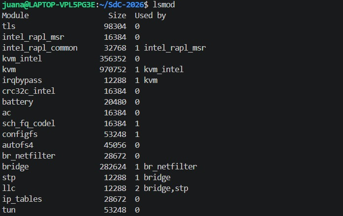

# Trabajo práctico 4 - Modulos de Kernel

## Nombres

- Nicolás Piñera
- Julián Krede
- Juana Pucheta Noguera

**Nombre del grupo**: Bare metal guys

## UNC - Facultad de Ciencias Exactas, Físicas y Naturales

## Cátedra: Sistema de Computadoras

### Profesores

- Javier Alejandro Jorge
- Miguel Ángel Solinas

**Fecha:** 4/5/2026

---

## Información de los autores

- **Información de contacto**:
  - [nicolas.pinera@mi.unc.edu.ar](mailto:nicolas.pinera@mi.unc.edu.ar)
  - [julian.krede@mi.unc.edu.ar](mailto:julian.krede@mi.unc.edu.ar)
  - [juana.pucheta.noguera@mi.unc.edu.ar](mailto:juana.pucheta.noguera@mi.unc.edu.ar)

---

---

## Índice

- [Trabajo práctico 4 - Modulos de Kernel](#trabajo-práctico-4---modulos-de-kernel)
  - [Nombres](#nombres)
  - [UNC - Facultad de Ciencias Exactas, Físicas y Naturales](#unc---facultad-de-ciencias-exactas-físicas-y-naturales)
  - [Cátedra: Sistema de Computadoras](#cátedra-sistema-de-computadoras)
    - [Profesores](#profesores)
  - [Información de los autores](#información-de-los-autores)
  - [Índice](#índice)
  - [Introducción](#introducción)
  - [Resultados](#resultados)
    - [CheckInstall](#checkinstall)
      - [Creación de un paquete para Ubuntu con CheckInstall](#creación-de-un-paquete-para-ubuntu-con-checkinstall)
    - [Funciones de un programa vs. un módulo](#funciones-de-un-programa-vs-un-módulo)
      - [Programa](#programa)
      - [Módulo](#módulo)
    - [Espacio de Usuario vs. Kernel](#espacio-de-usuario-vs-kernel)
    - [Espacio de datos](#espacio-de-datos)
    - [Drivers y /dev](#drivers-y-dev)
    - [Módulos de Kernel](#módulos-de-kernel)
    - [Syscall](#syscall)
    - [Segmentation Fault](#segmentation-fault)
    - [Consecuencia principal del parche de Microsoft sobre GRUB](#consecuencia-principal-del-parche-de-microsoft-sobre-grub)
    - [Implicancia de desactivar Secure Boot como solución](#implicancia-de-desactivar-secure-boot-como-solución)
    - [Propósito principal del Secure Boot en el arranque](#propósito-principal-del-secure-boot-en-el-arranque)
  - [Conclusión](#conclusión)

## Introducción

Este trabajo práctico tiene como objetivo explorar los conceptos fundamentales relacionados con los módulos del kernel de Linux, la gestión de paquetes, y la distinción entre el espacio de usuario y el espacio de kernel. A lo largo del informe, se analizan herramientas como `CheckInstall` para la creación de paquetes `.deb`, se profundiza en la mecánica de las llamadas al sistema (syscalls) mediante `strace`, y se examinan las implicancias de seguridad del mecanismo de Secure Boot y las recientes controversias relacionadas con las actualizaciones de GRUB. Además, se aborda la implementación y carga de módulos del núcleo, destacando las diferencias críticas en privilegios y manejo de memoria en el Anillo 0.

---

## Resultados

### CheckInstall

CheckInstall es una herramienta de administración de software para sistemas operativos basados en Unix/Linux que automatiza la creación de paquetes binarios a partir de código fuente. Su función principal es interceptar el proceso de instalación manual para generar un paquete manejable por el gestor de paquetes local (como APT, RPM o Pacman).

En el flujo de trabajo estándar de compilación, el comando final distribuye archivos a través de diversos directorios del sistema de archivos sin que el gestor de paquetes tenga registro de ellos. Esto dificulta la actualización, el rastreo y, especialmente, la desinstalación limpia del software. CheckInstall interviene en este proceso mediante las siguientes acciones:

1. **Monitorización de archivos**: realiza un seguimiento de cada archivo que el script de instalación intenta crear o modificar en el sistema.
2. **Encapsulamiento**: en lugar de permitir una instalación dispersa, agrupa todos los archivos resultantes en un único paquete binario (por ejemplo, un archivo _.deb_ para Debian/Ubuntu o _.rpm_ para Red Hat/Fedora).
3. **Integración con el gestor de paquetes**: instala dicho paquete utilizando las utilidades del sistema, asegurando que el software figure en la base de datos de aplicaciones instaladas.

Es importante notar que CheckInstall está diseñado para la gestión de sistemas locales o entornos de pruebas. No genera paquetes que cumplan estrictamente con las políticas de empaquetado de las distribuciones (como el _Debian Policy Manual_), por lo que no debe sustituir a las herramientas de empaquetado profesional si el objetivo es la distribución en repositorios públicos oficiales.

#### Creación de un paquete para Ubuntu con CheckInstall

Para esta sección decidimos crear un pequeño paquete; en vez del "hola mundo" tradicional, desarrollamos una calculadora con operaciones básicas (multiplicación, división, suma, resta y potencia). El código fuente se encuentra en [Calculadora](/TP4/src/paquete/main.c). Para que el proceso de empaquetamiento sea exitoso, el sistema debe contar con el conjunto de herramientas de desarrollo estándar:

- **build-essential**: contiene el compilador GCC y la utilidad make. Son necesarios para transformar el código fuente en un binario ejecutable.
- **checkinstall**: la herramienta núcleo que monitorea la instalación y genera el paquete .deb, .rpm o Slackware.
- **Archivos de proyecto**:
  - Código fuente (.c): el programa en lenguaje de alto nivel.
  - Makefile: el archivo de configuración que define las instrucciones de compilación e instalación. Es el que permite a CheckInstall automatizar el proceso.

El Makefile es la pieza fundamental porque actúa como el "mapa" para CheckInstall. Sin un bloque de instrucción `install`, la herramienta no sabrá qué archivos debe incluir en el paquete. Una consideración importante es el uso de la variable `$(DESTDIR)` en entornos de empaquetado, ya que permite redirigir la instalación a una ubicación temporal durante la creación del paquete sin afectar los directorios raíz del sistema prematuramente.

Una vez configurado el proyecto, ejecutamos lo siguiente:

```bash
# Compilamos el código
make

# Generamos el paquete
sudo checkinstall
```

En lugar de utilizar `sudo make install`, se invoca a **checkinstall**. Esta herramienta ejecutará las instrucciones de instalación del Makefile dentro de un entorno controlado. Durante la ejecución, el administrador debe interactuar con la terminal para definir la identidad del paquete: descripción, nombre del paquete, versión y arquitectura.


### Funciones de un programa vs. un módulo

La disponibilidad de funciones y la forma en que estas se invocan dependen estrictamente del nivel de privilegio en el que se ejecuta el código. Esta distinción es fundamental para la estabilidad y seguridad del sistema operativo.

#### Programa

Un programa convencional es un archivo ejecutable que opera en el **Modo Usuario o Espacio de Usuario**, y sus capacidades están limitadas por el entorno de ejecución proporcionado por las bibliotecas del sistema. Es una entidad independiente que contiene instrucciones destinadas a realizar una tarea específica.

- **Punto de entrada**: utiliza la función estándar `main()` como inicio de la ejecución.
- **Bibliotecas estándar (API)**: tiene acceso a funciones de alto nivel proporcionadas por bibliotecas como glibc (`printf()`, `malloc()`, `scanf()`).
- **Llamadas al sistema (Syscalls)**: para interactuar con el hardware o realizar tareas protegidas (leer un archivo, enviar datos por red), el programa debe invocar funciones de interfaz que solicitan permiso al kernel (ej. `read()`, `write()`, `open()`).
- **Aislamiento**: las funciones de un programa no pueden acceder directamente a la memoria de otro programa ni a las estructuras internas del núcleo. Se ejecuta en una "caja de arena" virtual.
- **Gestión**: el sistema operativo puede detenerlo, pausarlo o eliminarlo si falla, sin que el resto del sistema se vea afectado.

#### Módulo

Un **Módulo Cargable del Núcleo (LKM - Loadable Kernel Module)** se ejecuta en el **Modo Supervisor o Espacio de Kernel**, formando parte del corazón del sistema operativo. Es una extensión del núcleo que se puede cargar y descargar según sea necesario sin tener que reiniciar el equipo. Se ejecuta en el nivel más alto de privilegio del procesador **(Anillo 0)** y tiene acceso total al hardware y a toda la memoria del sistema. Generalmente se utilizan para añadir **soporte de hardware** (_drivers_), sistemas de archivos o protocolos de red.

- **Punto de entrada y salida**: no posee un `main()`. En su lugar, implementa funciones de registro y desregistro, típicamente `module_init()` (para inicializar recursos) y `module_exit()` (para liberarlos).
- **Funciones del núcleo (símbolos exportados)**: no puede utilizar bibliotecas de usuario (no existe `stdio.h` en el kernel). Utiliza funciones internas del núcleo que han sido "exportadas" para ser compartidas. Por ejemplo: `printk()` (equivalente a `printf` para el log del sistema) o `kmalloc()` (para gestión de memoria física).
- **Gestión de interrupciones y drivers**: tiene acceso a funciones de bajo nivel para manipular registros de hardware, gestionar interrupciones (IRQs) y registrarse como manejador de dispositivos (_drivers_).
- **Privilegio total**: las funciones de un módulo pueden acceder a cualquier dirección de memoria del sistema, lo que otorga máxima potencia pero conlleva el riesgo de que un error de programación detenga el sistema completo (_Kernel Panic_).

### Espacio de Usuario vs. Kernel

El procesador utiliza mecanismos de protección (niveles de privilegio o _rings_) para separar estas dos áreas de memoria RAM con el fin de proteger la estabilidad del equipo:

- **Espacio de Usuario (User Space)**: es el área de memoria donde se ejecutan las aplicaciones del usuario. Las aplicaciones aquí tienen un privilegio restringido; no pueden acceder directamente al hardware ni a la memoria de otros procesos. Si un programa falla, el sistema operativo permanece estable.
- **Espacio del Kernel (Kernel Space)**: es el área donde reside el núcleo del sistema operativo y sus extensiones (módulos). Tiene acceso total y sin restricciones al hardware y a toda la memoria del sistema. Un error en este espacio puede provocar un fallo crítico del sistema (_Kernel Panic_).

### Espacio de datos

En el contexto de la ejecución de procesos, el espacio de datos es la sección de la memoria virtual asignada a un programa que contiene las variables y estructuras necesarias para su funcionamiento. Se subdivide principalmente en:

- **Datos estáticos**: variables globales y estáticas inicializadas durante la compilación.
- **Heap (Montículo)**: memoria dinámica solicitada en tiempo de ejecución (ej. mediante `malloc`).
- **Stack (Pila)**: almacena variables locales y direcciones de retorno de funciones.

En el desarrollo de módulos, el espacio de datos es crítico, ya que el kernel debe gestionar su propia memoria de forma manual y extremadamente cuidadosa para evitar fugas de memoria (_memory leaks_) que comprometan la estabilidad global.

### Drivers y /dev

Los _drivers_ (controladores de dispositivos) actúan como traductores entre el sistema operativo y el hardware físico. En sistemas tipo Unix, se implementa la filosofía de que "todo es un archivo", lo que permite interactuar con el hardware a través del sistema de archivos.

El directorio `/dev` (_devices_) contiene archivos especiales que representan los dispositivos del sistema. No son archivos almacenados en el disco, sino interfaces para comunicarse con los _drivers_ del kernel.

### Módulos de Kernel

```bash
# Cargamos el módulo
sudo insmod <nombre_modulo>

# Lo buscamos en la lista de módulos de kernel
lsmod | grep <nombre_modulo>
cat /proc/modules | grep <nombre_modulo>


# Para ver los mensajes del kernel
dmesg

# Remover el módulo
sudo rmmod <nombre_modulo>

# Obtener información de un módulo
modinfo mimodulo.ko
modinfo /lib/modules/$(uname -r)/kernel/crypto/des_generic.ko.zst
```

Al comparar los resultados de `modinfo` entre nuestro módulo de desarrollo (`mimodulo.ko`) y un módulo oficial del sistema (`des_generic.ko.zst`), se observan diferencias críticas que explican por qué uno se carga sin problemas y el otro es rechazado por el kernel con _Secure Boot_ activado.


1. **Firma digital y seguridad**: el módulo del sistema posee campos de firma legibles. Esto indica que el módulo fue firmado durante la compilación oficial de la distribución. El kernel verifica esta firma contra su base de datos de claves confiables antes de permitir la inserción.
2. **Origen y ubicación**: el módulo del sistema se encuentra en `/lib/modules`; esto significa que el módulo es parte del árbol oficial de código fuente de Linux (_in-tree_). Nuestro módulo es un módulo _out-of-tree_, compilado de forma independiente al código fuente principal del kernel.
3. **Alias de dispositivos**: el módulo del sistema tiene múltiples alias, lo que permite que el kernel cargue el módulo automáticamente cuando una aplicación solicita un algoritmo de cifrado específico. Nuestro módulo no tiene alias, por lo que solo puede ser cargado manualmente mediante el nombre del archivo.

> [!NOTE]
>
> 1. Revisar la bibliografía para impulsar acciones que permitan mejorar la seguridad del kernel, concretamente: evitando cargar módulos que no estén firmados (¿rootkits?).
> 2. ¿Qué drivers/módulos están cargados en sus propias PC? Comparen las salidas con las computadoras de cada integrante del grupo. Expliquen las diferencias. Carguen un txt con la salida de cada integrante en el repo y pongan un diff en el informe.
> 3. ¿Cuáles no están cargados pero están disponibles? ¿Qué pasa cuando el driver de un dispositivo no está disponible?
> 4. Correr `hwinfo` en una PC real con hardware real y agregar la URL de la información de hardware en el reporte (Exclusivo Windows).
> 5. ¿Se animan a intentar firmar un módulo de kernel y documentar el proceso? [Guía de referencia](https://askubuntu.com/questions/770205/how-to-sign-kernel-modules-with-sign-file).
> 6. Agregar evidencia de la compilación, carga y descarga de su propio módulo imprimiendo el nombre del equipo en los registros del kernel (no deben tener _Secure Boot_ activado).
> 7. ¿Qué pasa si mi compañero con _Secure Boot_ habilitado intenta cargar un módulo firmado por mí?

Cuando conectas un hardware (USB, PCI, etc.) y el kernel no encuentra un _driver_ compatible, ocurren los siguientes eventos técnicos:

1. **Identificación sin control (udev)**: el bus detecta eléctricamente el dispositivo. El sistema lee los identificadores Vendor ID y Product ID. El dispositivo aparecerá en la lista, pero no funcionará.
2. **Ausencia de interfaz en /dev**: los _drivers_ crean un archivo especial en `/dev`. Si el _driver_ no está disponible, no se crea el nodo de dispositivo y las aplicaciones fallan (_Device not found_).
3. En el log del sistema (_dmesg_), se observa que el hardware fue detectado, pero no aparecerán los mensajes típicos de "driver assigned" o "initialized".

### Módulos cargados en un WSL

A continuación se muestra la salida de `lsmod` en un entorno WSL:



> Nota: Al ejecutarse sobre WSL, los módulos cargados reflejan
> el kernel virtualizado de Windows, no el hardware físico directo.

### Syscall

Una llamada al sistema (o _System Call_) es el mecanismo fundamental que utiliza un programa para solicitar un servicio al núcleo (_kernel_) del sistema operativo. Es la interfaz que permite que un programa pase del Espacio de Usuario (donde tiene permisos restringidos) al Espacio de Kernel (donde el sistema operativo tiene control total sobre el hardware).

Para poder ver las llamadas al sistema que realiza un código en C, podemos utilizar la herramienta `strace`. Para ello debemos realizar lo siguiente:

```bash
# Compilamos el código fuente
gcc ejemplo_printf.c -o syscall

# Ejecutar strace
strace ./syscall

# Para ver cuántas veces se llamó a cada syscall hacemos:
strace -c ./syscall
```


### Segmentation Fault

Un _Segmentation Fault_ (_segfault_) es un error específico de gestión de memoria que ocurre cuando un programa intenta acceder a una dirección de memoria que no le pertenece o a la que no tiene permisos de acceso. Es la forma en que el hardware y el sistema operativo protegen la integridad de la memoria. Es la materialización de la protección de memoria otorgada por el modelo de Anillos de Protección y Paginación. Técnicamente, sucede cuando la **MMU** (Unidad de Gestión de Memoria) detecta una violación de las reglas establecidas en las tablas de paginación. El proceso que realiza el kernel es el siguiente:

1. **Detección por hardware**: cuando el procesador intenta ejecutar la instrucción de memoria inválida, la MMU genera una **excepción** de hardware.
2. **Intervención del kernel**: el control pasa inmediatamente del programa al kernel. Este identifica qué proceso causó la falta y por qué.
3. **Envío de señal**: el kernel envía una señal específica al proceso infractor llamada **SIGSEGV** (_Signal Segmentation Violation_).
4. **Terminación**: por defecto, si el programa no maneja esa señal, el kernel lo finaliza para evitar que corrompa otros datos y suele generar un archivo llamado **core dump**, que contiene el estado de la memoria en ese instante para su posterior análisis por el programador.

Un programa tiene dos formas de lidiar con un _segmentation fault_:

1. **Manejo por defecto**: la mayoría de los programas no implementan acciones especiales. Al recibir la señal **SIGSEGV**, el sistema operativo los finaliza abruptamente y el usuario visualiza el mensaje en consola: `Segmentation fault (core dumped)`.
2. **Manejo personalizado (Signal Handling)**: un programa puede intentar capturar la señal usando las funciones `signal()` o `sigaction()` de la librería de C. Se puede programar para que, antes de finalizar, el programa guarde un log de error o cierre archivos abiertos de forma segura. Intentar ignorar un _segfault_ y continuar la ejecución es extremadamente peligroso y casi nunca viable, dado que la instrucción que causó el error sigue siendo inválida y el programa entraría en un bucle infinito de excepciones.

### Consecuencia principal del parche de Microsoft sobre GRUB

La consecuencia principal fue que los sistemas con arranque dual (_dual-boot_) configurados para ejecutar tanto Windows como Linux perdieron la capacidad de iniciar las distribuciones de Linux cuando la función _Secure Boot_ estaba activada. Al intentar cargar Linux, los usuarios recibieron un mensaje de error crítico: “Something has gone seriously wrong”, seguido de una notificación de fallo en la verificación de datos SBAT por una violación de la política de seguridad. Aunque Microsoft inicialmente afirmó que la actualización no se aplicaría a sistemas de arranque dual, el parche afectó a múltiples distribuciones recientes, incluidas Ubuntu 24.04 y Debian 12.6.0, bloqueando su acceso por completo.

### Implicancia de desactivar Secure Boot como solución

Desactivar _Secure Boot_ en el panel EFI es una de las soluciones inmediatas para recuperar el acceso al sistema Linux, pero conlleva una implicancia de seguridad significativa: el dispositivo deja de verificar la integridad del firmware y del software cargado durante el inicio.

- **Vulnerabilidad**: al desactivarlo, el sistema queda expuesto a la carga de código malicioso antes de que el sistema operativo tome el control.
- **Alternativa recomendada**: el artículo sugiere que una opción preferible a corto plazo es eliminar la política SBAT específica que Microsoft instaló. Esto permite que el sistema vuelva a arrancar manteniendo los beneficios generales de _Secure Boot_, aunque el usuario siga siendo vulnerable específicamente al exploit de GRUB (CVE-2022-2601) que el parche intentaba mitigar.

### Propósito principal del Secure Boot en el arranque

El propósito fundamental de _Secure Boot_ es actuar como un estándar de la industria para garantizar que los dispositivos no carguen firmware o software malicioso durante el proceso de inicio del sistema. Su funcionamiento se basa en un mecanismo de confianza donde:

- La UEFI solo ejecuta cargadores de arranque (como GRUB o el gestor de Windows) que estén firmados con claves válidas.
- Utiliza un mecanismo llamado SBAT (_Secure Boot Advanced Targeting_) para revocar componentes específicos del proceso de arranque si se descubre que son vulnerables, evitando así que atacantes utilicen versiones antiguas o comprometidas para eludir las protecciones del sistema.
- En esencia, busca asegurar que la "cadena de arranque" desde el hardware hasta el sistema operativo sea íntegra y confiable.

---

## Conclusión

La realización de este trabajo práctico permitió comprender la arquitectura de niveles de privilegio en los sistemas operativos modernos. La distinción entre el espacio de usuario y el espacio de kernel no es solo conceptual, sino una barrera física gestionada por el hardware (MMU) que garantiza la estabilidad del sistema frente a errores de programación o ataques maliciosos.

Se destaca la potencia y responsabilidad que conlleva el desarrollo de módulos de kernel, donde un error mínimo puede derivar en un _Kernel Panic_. Asimismo, el análisis de _Secure Boot_ y los incidentes con GRUB ponen de manifiesto la compleja relación entre la seguridad del firmware y la libertad de ejecución en entornos _multi-boot_. Herramientas como `CheckInstall` y `strace` resultaron fundamentales para desmitificar procesos que ocurren "detrás de escena" en la instalación y ejecución de software en sistemas Linux.
